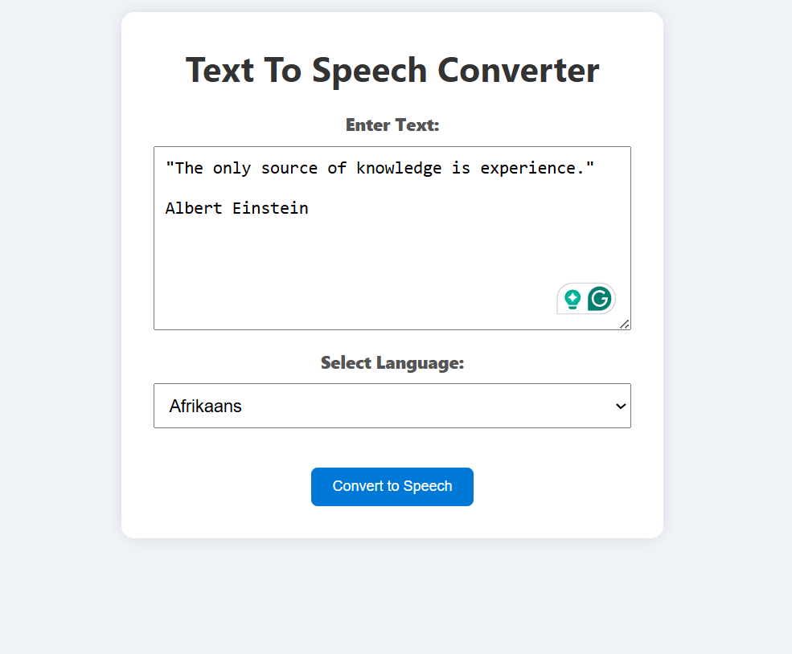
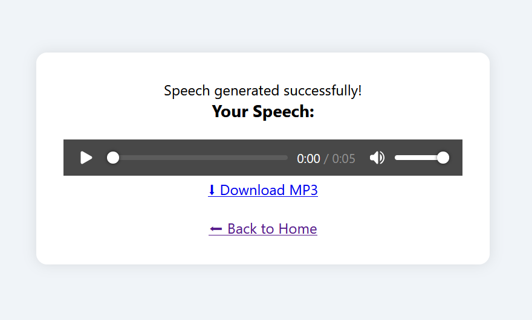

# Text to Speech Web App


[](https://opensource.org/licenses/MIT)

This project is a Flask based web application built with Python, HTML, and CSS.
It converts written text into natural speech using Google Text-to-Speech (gTTS).

I built this project to listen to text, articles, and books online in multiple languages.
Users can enter any text, choose a language, and the app generates an MP3 file that can be played or downloaded.

---


---

### Example Speech Output

You can listen to an example of the generated speech below:

https://github.com/user-attachments/assets/399f7290-9730-4750-a43a-0c4c80a2cb9a

<p align="center">
  
</p>

<br>
<p align="center">
  
</p>

---

# Docker Image

I’ve also containerized this project using **Docker**.  
You can pull the image from **Docker Hub** and run it instantly on your own system — no manual setup needed.

**Docker Hub Repository:**  
[flask-web-gtts-app](https://hub.docker.com/repository/docker/amankoray/flask-web-gtts-app/general)

# Run the Flask Web GTTs App

### Run it in 3 Simple Steps

Windows: Make sure Docker Desktop is running.  
Install guide: [Install Docker Desktop on Windows](https://docs.docker.com/desktop/setup/install/windows-install/)

Linux: Make sure Docker is installed.  
Guide: [Install Docker Engine on Linux](https://docs.docker.com/engine/install/ubuntu/)

You can also use any container engine of your choice.  
Docker is not strictly required, but it is simple and widely used.

```bash
# 1. Pull the image from Docker Hub
docker pull amankoray/flask-web-gtts-app:v1.0

# 2. Run the container
docker run -p 5000:5000 amankoray/flask-web-gtts-app:v1.0
---
```
