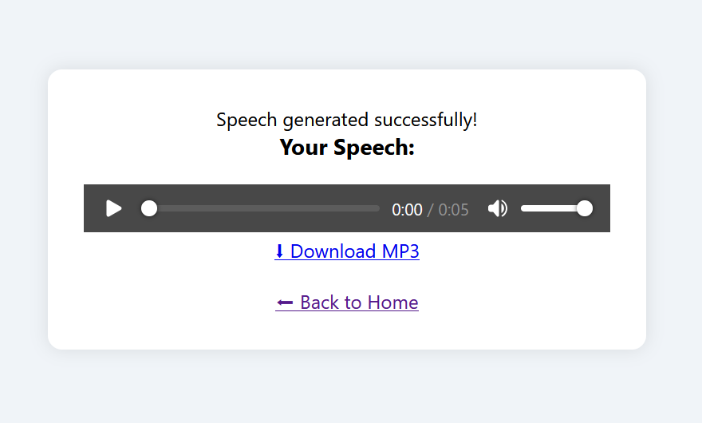

# Webbapp för text-till-tal


[](https://opensource.org/licenses/MIT)

Det här projektet är en Flask-baserad webbapplikation byggd med Python, HTML och CSS.
Den omvandlar skriven text till naturligt tal med Google Text-to-Speech (gTTS).

Jag byggde det här projektet för att lyssna på text, artiklar och böcker online på flera språk.
Användare kan mata in valfri text, välja ett språk och appen genererar en MP3-fil som kan spelas upp eller laddas ned.

---


---

### Exempel på talutmatning

Du kan lyssna på ett exempel på det genererade talet nedan:

https://github.com/user-attachments/assets/399f7290-9730-4750-a43a-0c4c80a2cb9a

<p align="center">
  
</p>

<br>
<p align="center">
  
</p>

---

# Docker-image

Jag har även containeriserat det här projektet med **Docker**.  
Du kan hämta imaget från **Docker Hub** och köra det direkt på din egen dator — ingen manuell installation behövs.

**Docker Hub-respository:**  
[flask-web-gtts-app](https://hub.docker.com/repository/docker/amankoray/flask-web-gtts-app/general)

### Kör i 2 enkla steg

```bash
# 1. Hämta imaget från Docker Hub
docker pull amankoray/flask-web-gtts-app:v1.0

# 2. Starta containern
docker run -p 5000:5000 amankoray/flask-web-gtts-app:v1.0

```

Öppna sedan din webbläsare och gå till:
http://localhost:5000

Klart! Du har Webbappen för text-till-tal igång på några sekunder på din maskin.

## Användbara länkar

- [Flask Dokumentation](https://flask.palletsprojects.com/en/stable/)
- [gTTS (Google Text-to-Speech) på PyPI](https://pypi.org/project/gTTS/)
- [Python – officiella nedladdningar](https://www.python.org/downloads/)
- [Lista över språk som stöds av gTTS](https://gtts.readthedocs.io/en/latest/module.html#available-languages)
- [Flask (web_framework)](<https://en.wikipedia.org/wiki/Flask_(web_framework)>)

---
